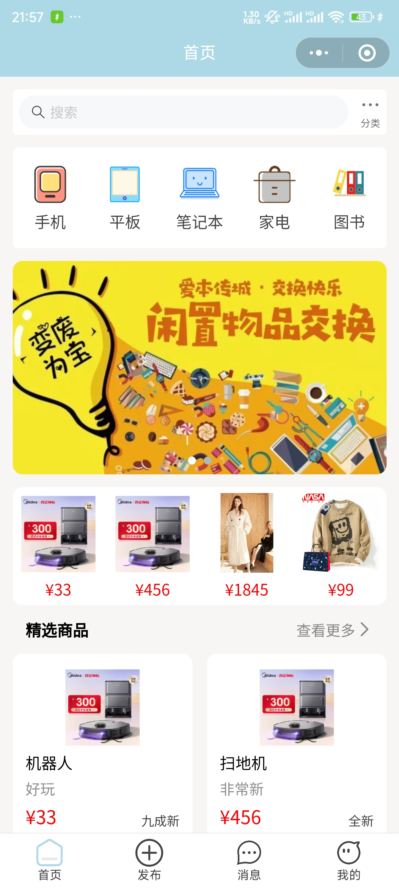
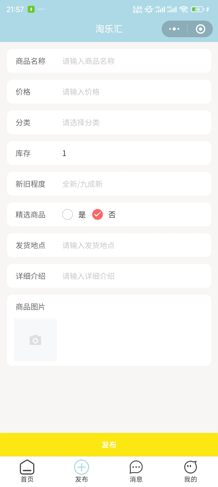
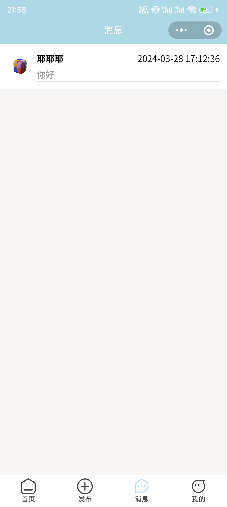
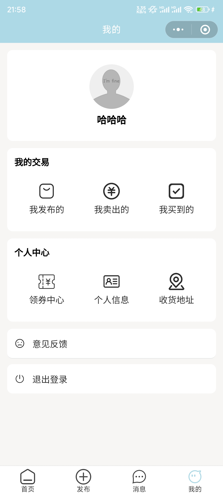
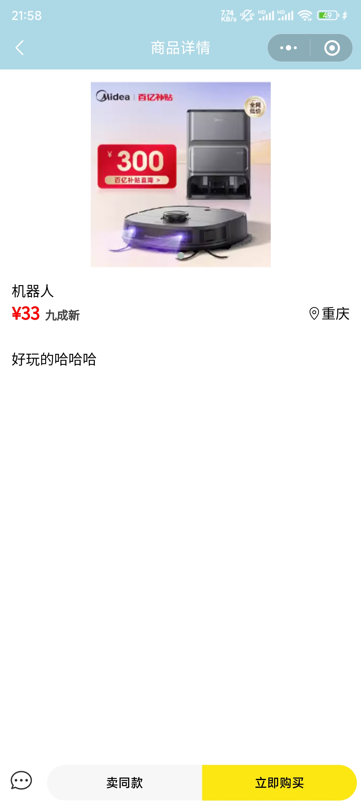
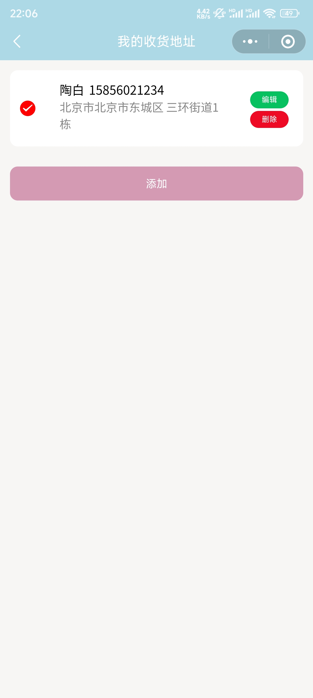
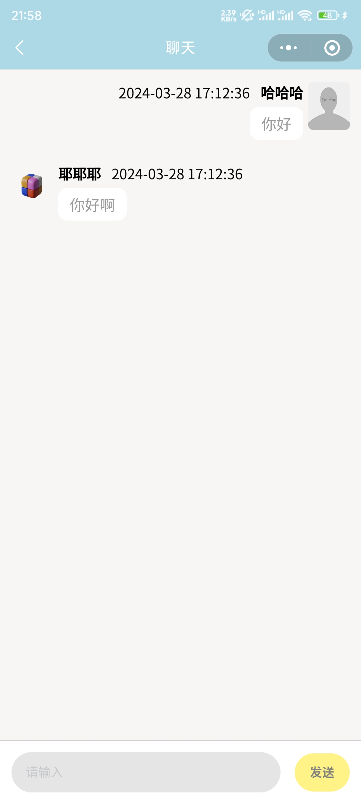
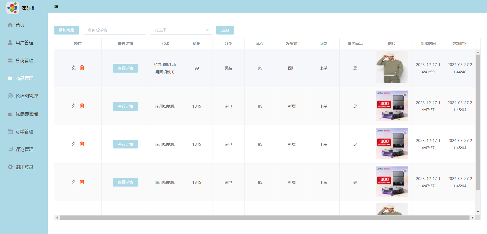

# 二手商城小程序 校园闲置物品交易系统（个人独立编写，不是网上资源）
## 一、介绍（获取源码，[查看文章末尾](#四-咨询我们)） 
计算机毕业设计 校园闲置物品交易系统 二手商城小程序，前后端分离，
 有登录、注册、在线聊天，发布物品，地址管理，优惠券领取等功能

[点击我查看更多项目](https://www.yuque.com/rolling-k87y2/qrtzd0/gusuavwrtwe0ingz?singleDoc) 
## 二、技术栈
1. 前端：vue框架，微信原生小程序
2. 后端：nodejs express框架
3. 数据库：mysql

## 三、效果展示  
### 1. 用户端（小程序）

 

 

 

### 2. 后台管理（管理端）

## 四、🚀 咨询我们
1. **个人手敲，独立编写项目，不是网上所找的资源**
2. 提示该项目需要付费获取，编码不易，有需要或者疑问可加微信号：rolling_257
3. 扫一扫加我微信好友吧，请备注 二手商城小程序源码获取

[点击我查看更多项目](https://www.yuque.com/rolling-k87y2/qrtzd0/gusuavwrtwe0ingz?singleDoc) 

